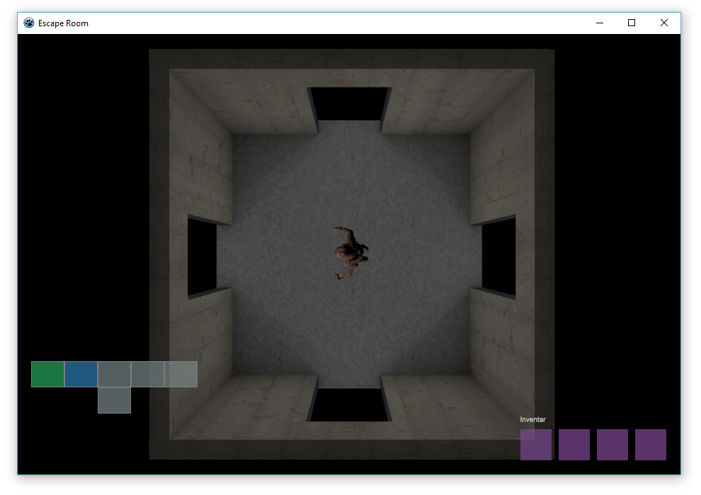
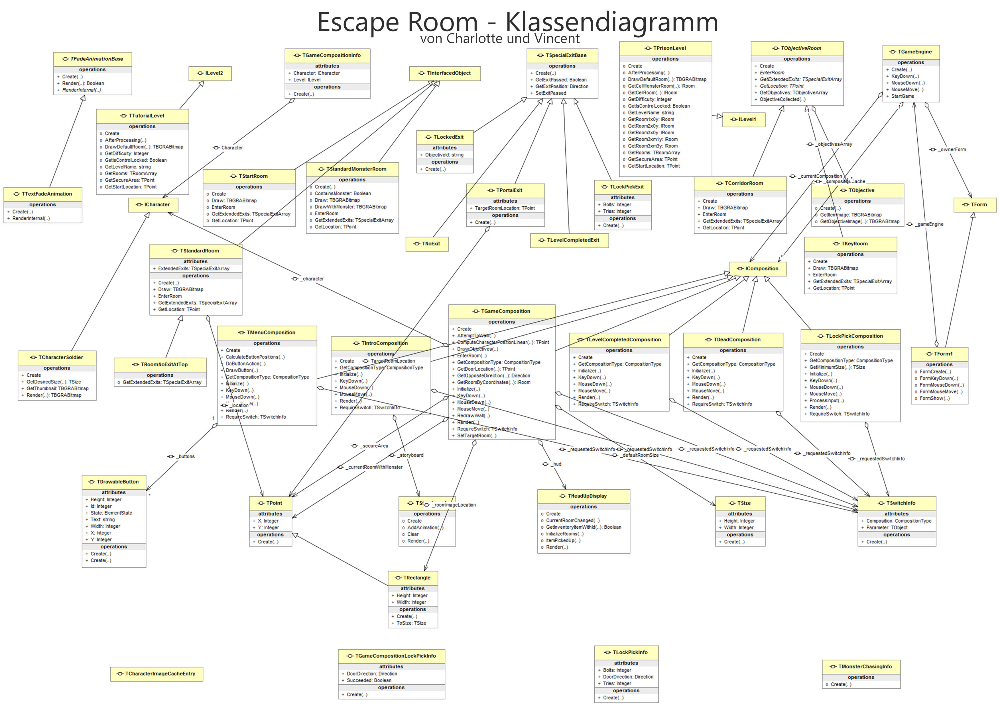

# EscapeRoom
A small project from my computer science class in the 12th grade I made together with a classmate. We got 15 of 15 points. Written in Lazarus 1.6.
The images are rendered by myself in Cinema 4D (source file is found in this repository)

# Class diagram

# License
EscapeRoom is licensed under the [GNU General Public License](license)
